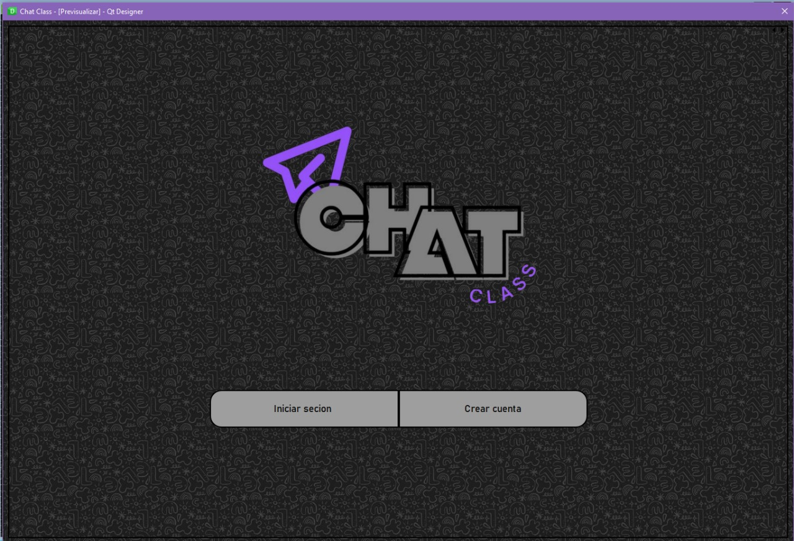
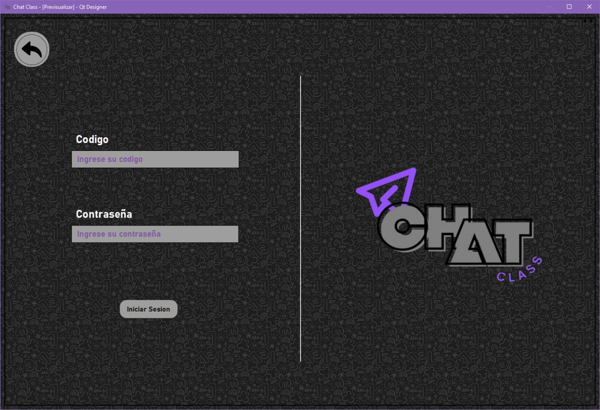
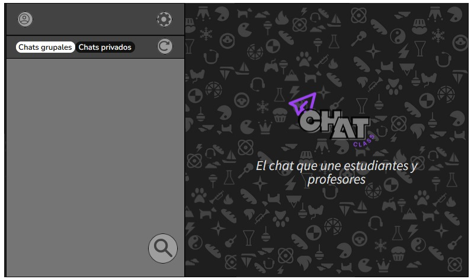
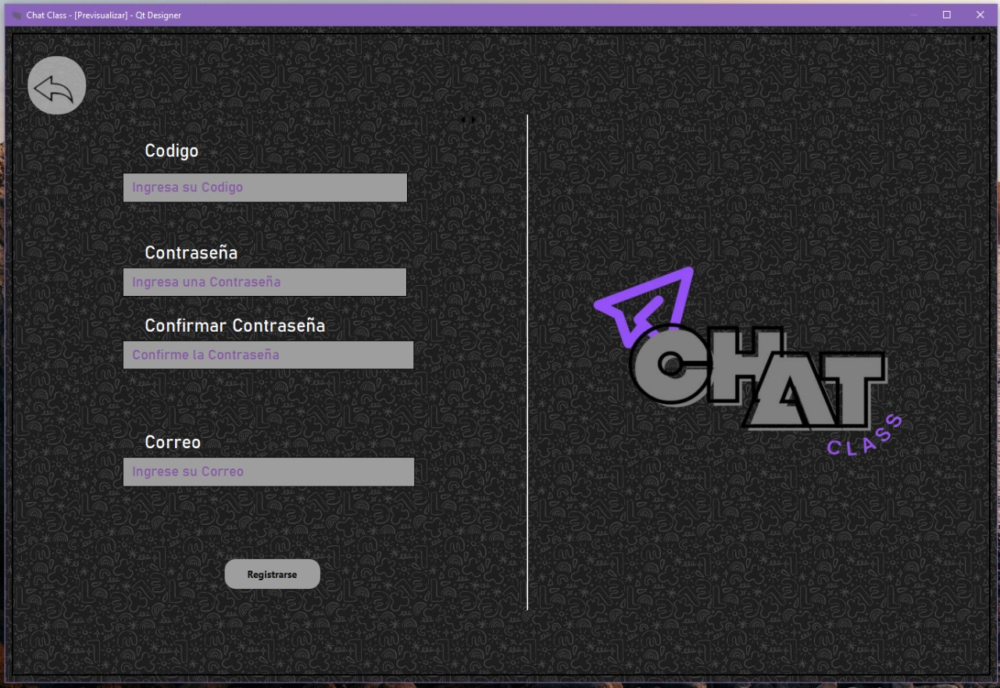
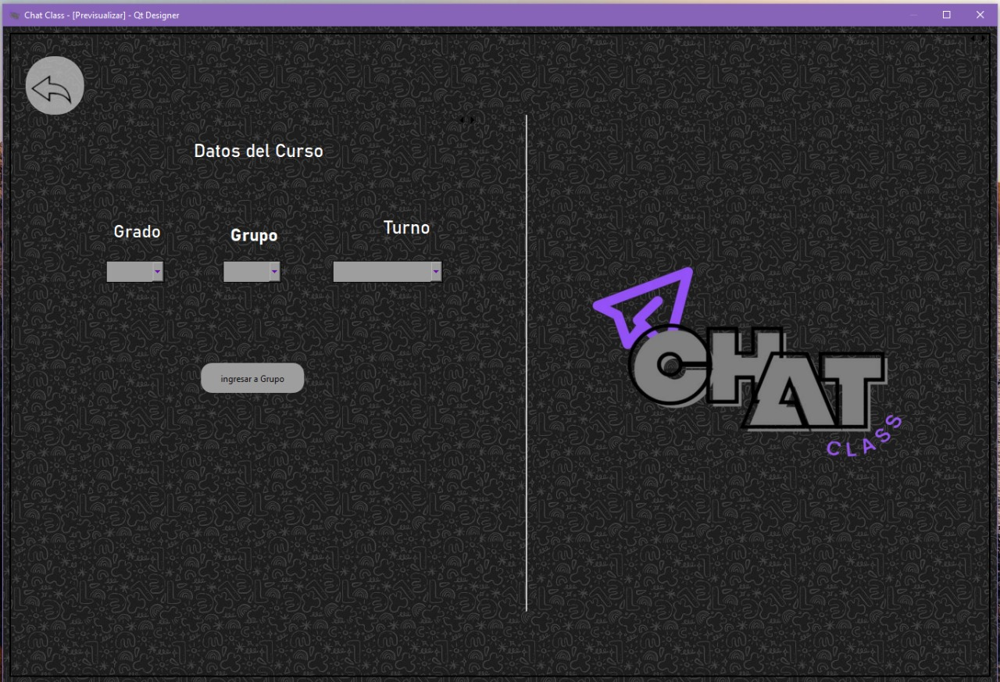
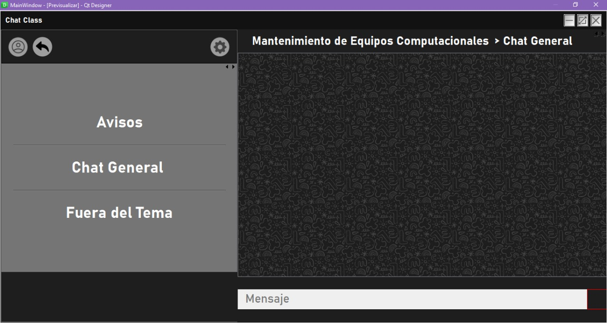

# ChatClass

## Español

###  Contexto

ChatClass es un proyecto desarrollado durante la preparatoria junto a mi equipo, nacido a partir de un problema real: la mala comunicación entre alumnos y maestros.

Realizamos encuestas a estudiantes y concluimos que:

> Herramientas como WhatsApp, Discord o WebEx no están diseñadas para una comunicación académica estructurada.

---

### Idea del Proyecto

El objetivo de ChatClass es ofrecer:

* Comunicación directa entre alumnos y maestros
* Chats privados y grupales
* Organización más clara en entornos educativos
* (Idea futura) Integración con Moodle para entrega de tareas

---

### ⚠️ Estado del Proyecto

Este proyecto fue desarrollado con conocimientos limitados en backend y comunicación en tiempo real.

* El sistema de mensajes no es robusto
* Algunas soluciones no están optimizadas
* La arquitectura puede no seguir buenas prácticas

Este repositorio se comparte con la intención de recibir feedback (constructivo o destructivo 😄)

---

### Tecnologías

* PySide6
* PyQt6
* PyQt6-tools
* click
* mysql-connector-python

---

### Base de Datos

El proyecto funciona con base de datos local (MySQL):

* XAMPP
* WampServer

Se llego a implementar AWS, pero se elimino por faltas de optimizacion.

---

### ▶️ Cómo ejecutar

1. Clonar repositorio
2. Instalar dependencias
3. Configurar base de datos local
4. Ejecutar archivo principal (InicarSesion_y_Registro.py)

---

### Qué buscamos mejorar

* Arquitectura del proyecto
* Comunicación en tiempo real
* Organización del código
* Buenas prácticas
* UI/UX
* Escalabilidad

---

## English

### Context

ChatClass is a project developed during high school with my team, created to solve a real problem: poor communication between students and teachers.

After running surveys, we concluded:

> Tools like WhatsApp, Discord, or WebEx are not designed for structured academic communication.

---

### Project Idea

ChatClass aims to provide:

* Direct communication between students and teachers
* Private and group chats
* Better organization for academic environments
* (Future idea) Moodle integration for assignments

---

### ⚠️ Project Status

This project was built with limited knowledge of backend systems and real-time communication.

* Messaging system is not robust
* Some solutions are not optimized
* Architecture may not follow best practices

This repository is shared to receive feedback (constructive or destructive 😄)

---

### Technologies

* PySide6
* PyQt6
* PyQt6-tools
* click
* mysql-connector-python

---

### Database

The project uses a local database (MySQL):

* XAMPP
* WampServer

An AWS implementation was attempted but later removed due to lack of optimization.

---

### ▶️ How to run

1. Clone the repository
2. Install dependencies
3. Set up a local database
4. Run the main file (InicarSesion_y_Registro.py)

---

### What we want to improve

* Project architecture
* Real-time communication
* Code organization
* Best practices
* UI/UX
* Scalability

---

## Feedback

This project was made as a school project and learning experience.
I would really appreciate feedback, code review, and suggestions to improve the architecture, UI, and message handling.

Feel free to open an Issue or a Pull Request.

## Screenshots

### Inicio

  

### Login

  

### Ventana Principal

  

### Registro

  

### Registro Parte 2

  

### Chat

  

